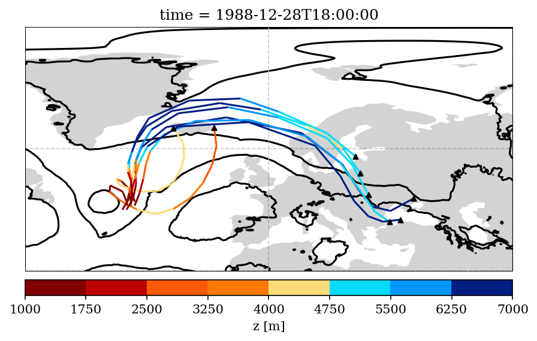

#################################################
Lagranto.MPAS - Lagrangian analysis tool for MPAS
#################################################

This is the version of LAGRANTO used to compute air-parcel trajectories based on the output of the Model for Prediction Across Scales (`MPAS <https://mpas-dev.github.io/>`_).   

The Lagrangian analysis tool LAGRANTO is widely used in the atmospheric sciences, for instance, to identify flow structures in extratropical cyclones (e.g., warm conveyor belts), long-range transport pathways of moisture, or to study the physical processes underlying the formation of potential vorticity anomalies.

LAGRANTO is develped at the `Institute for Atmospheric and Climate Science <https://iac.ethz.ch/group/atmospheric-dynamics.html>`_ at ETH Zurich by Dr. Michael Sprenger and Prof. Heini Wernli.    

For more information see `http://www.lagranto.ethz.ch <http://www.lagranto.ethz.ch>`_.

============
Installation
============

Using install.csh
-----------------

Compiling the Lagranto code on a Linux platform:   

.. code:: bash

   >./code/install.csh [lib|core|all|clean|test]

Fortran compiler *PGI* is used.

=========
Tutorial
=========

1 Meteorological Data
----------------------

The meteorological fields are on netCDF files named *latlon.current.YYYY-MM-DD_00:00:00.nc* 
containing 4 timesteps (every 6 hour: 00, 06, 12, 18).   
   
Needed fields are:   

 - zonal wind (uzonal, in m/s)   
 - meridional wind (umeridional, in m/s)   
 - vertical wind (w, in m/s)   
 - geometric height (height, in m)   
 - additional fields (temperature, specific humidity, ..) to be traced along the trajectories.   

2 Starting Position
--------------------

Starting positions are specified in a file *startf*:  

.. code:: bash

   > more example/startf_z
   0.00    -35    47    1000.00 
   0.00    -35    47    1500.00   
   0.00    -35    47    1000.00   
  
The different columns are: time (relative to initation date), longitude, latitude, height (in m).

3 Tracing Meteorological Fields
-------------------------------

Meteorological fields (in addition to time, lon, lat, z) to be traced are listed in a file *tracevars*:   

.. code:: bash

   > more example/tracevars
   temperature 1. P
  
The different columns are: name, scaling factor, location of field (P = Primary). In this case, P is latlon.current.YYYY-MM-DD_00:00:00.nc*. 

4 Trajectory Calculation
-------------------------

In this example, the trajectories are calculated 3 days (72) forward in time, stored every 6 h (-o 360), with starting date (-ref) 18 UTC, 28 December 1988. The command is:   

.. code:: bash

   > caltra startf_z 72 lsl_forward.1 -ref 19881228_1800 -o 360

The staring positions are taken from *startf_z* and the output is written to *lsl_forward.1*.

.. code:: bash

   > more example/lsl_forward.1
  Reference date 19881228_1800 / Time range    4320 min
 
  time       lon      lat     z temperatu
  ------------------------------------------
 
   0.00   325.000   46.000  1500   274.301   
   6.00   325.637   49.153  2722   266.827   
  12.00   326.411   52.902  4382   253.898   
  18.00   327.010   56.194  5748   242.070   
  24.00   328.731   60.388  7045   228.991   
  30.00   334.821   65.331  7559   222.908   
  36.00   349.509   67.713  7301   225.142   
  42.00     8.087   63.862  6967   227.987   
  48.00    17.993   56.261  6932   228.178   
  54.00    22.249   49.719  6931   228.324   
  60.00    25.509   45.767  7007   227.827   
  66.00    29.933   44.689  6997   227.905   
  72.00    35.660   47.792  6794   228.377   
  

4.1 Blocking Trajectory Calculation
------------------------------------------

The shell script *script/run_lagranto.sh* provides an example on calculating backward trajectories starting from blocking anticyclones.   
Starting position are taken from startfiles named *startf_YYYYMMDD_HH_FLAG*. These startfiles are created using the output "FLAG" from the Atmospheric blocking tracking index `ConTrack <https://github.com/steidani/ConTrack>`_.

5 Analysis and Platting of Trajectories
---------------------------------------

A Python library to work with trajectories can be found here: `https://lagranto.readthedocs.io/en/latest/ <https://lagranto.readthedocs.io/en/latest/>`_.

